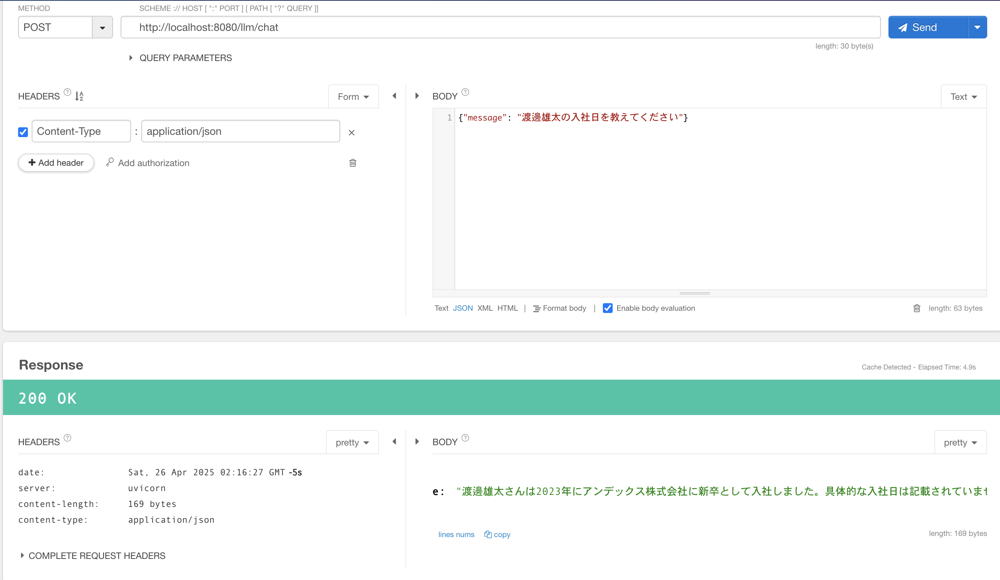

# watanabe-chatbot

## アプリケーション概要

- RAGを活用したチャットbotAPI
- 職務経歴書の情報をRAGにいれて、渡邊雄太のことを回答してくれるチャットbot

### 使用する技術

- 言語：Python
- APIフレームワーク：FastAPI
- LLMフレームワーク：LangChain
- VectorDB

### API仕様

エンドポイント：`localhost:8080/llm/chat`

HTTPメソッド：`POST`

#### ヘッダー

```

{

    "Content-Type": "application/json"

}

```

#### Body

```

{

    "message": "渡邊雄太の入社日を教えてください"

}

```

#### Response

```

{
    "response": "渡邊雄太さんは2023年にアンデックス株式会社に新卒として入社しました。具体的な入社日は記載されていません。"
}
```

### 結果




## ローカル開発環境の構築

### .envファイルの作成

以下のコマンドでローカル開発環境用の.envファイルを作成します。

```

cp environment/local/.env.example environment/local/.env

```

### コンテナの立ち上げ

以下のコマンドでローカル開発環境用のコンテナを立ち上げます。

```

bash dev.bash up

```
